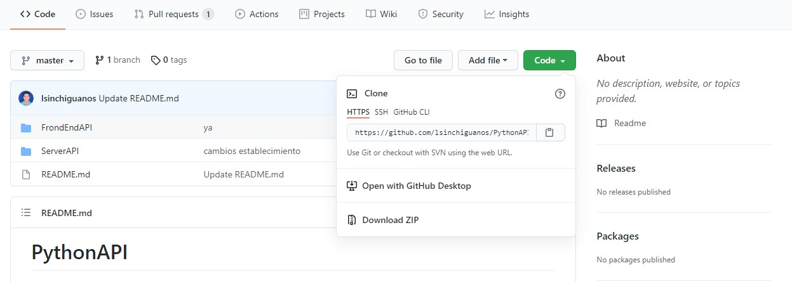
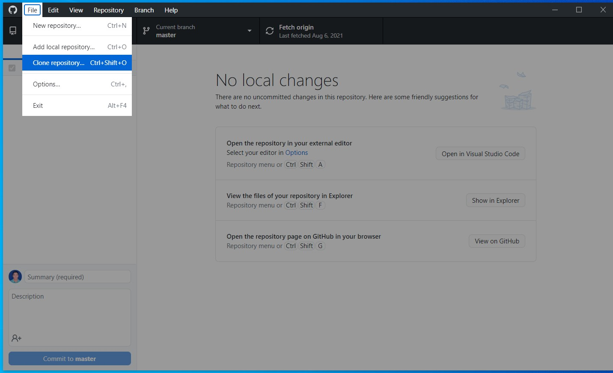
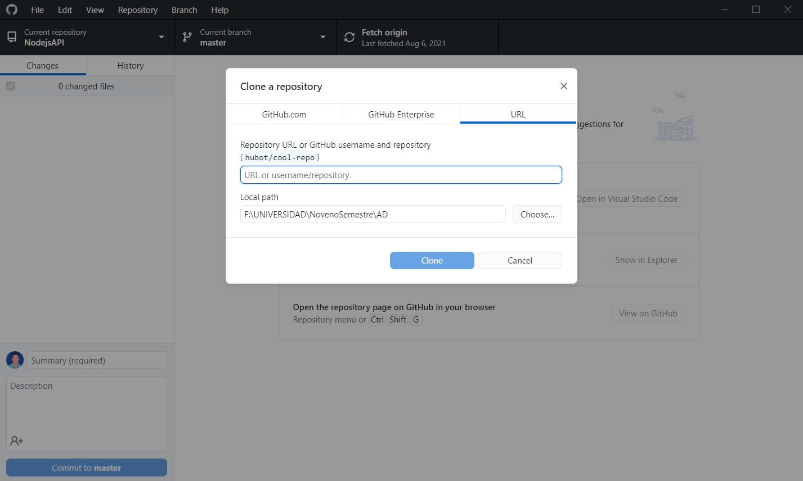

# PythonAPI
## Table of Contents
1. [Introducción](#introducción)
2. [Requisitos](#requisitos)
3. [Clonación](#clonación)
4. [Instalación](#instalación)
### Introducción
***
De acuerdo con la descripción de la actividad WEB SERVICES – PYTHON: Realizar una aplicación distribuida en la cual el FrontEnd consuma un Web Services que el BackEnd sea Python. Debe ser un ejemplo interesante. Se planteo el desarrollo de una App Web enfocada en la separación de turnos para el cobro de bono, debido a que los diferentes corresponsales no bancarios (CNB) poseen cupos limitados (50).
<br/> La limitante de cupos disponibles provoca que muchos acreedores madruguen a buscar cupos en los CNB de su localidad en ocasiones cerca del lugar de residencia, pero en casos no alcanzan cupo y terminan haciendo filas fuera de los corresponsable bancarios autorizados (Banco Pacifico, BanEcuador, etc.) generando costos en transportación y tiempo.
Los CNB en diversas situaciones suelen realizar un listado de los clientes acreedores del bono con la finalidad de reservar un cupo acorde al último digito de la cédula de identidad. La generación del listado requiere de tiempo y disponibilidad del encargado o propietario del negocio, aparte del riesgo de perder el listado o la inasistencia del cliente en la fecha establecida.
<br/> Para solucionar parte de estos problemas, se llegó a crear una App Web para la reserva de cupos, teniendo en cuenta que deba ser distribuida y cuyos llamados sean mediante una APIREST FULL realizada en Python.
### Requisitos
***
La aplicación se realizó utilizando python 3.7.7.
<br/> 
<br/> Los módulos necesarios para ejecutar el repositorio son:
* click: Version 8.0.1
* colorama: Version 0.4.4
* Flask: Version 2.0.1
* Flask-Cors: Version 3.0.10
* Flask-SQLAlchemy: Version 2.5.1
* greenlet: Version 1.1.0
* importlib-metadata: Version 4.6.3
* itsdangerous: Version 2.0.1
* Jinja2: Version 3.0.1
* MarkupSafe: Version 2.0.1
* marshmallow: Version 3.13.0
* psycopg2: Version 2.9.1
* six: Version 1.16.0
* SQLAlchemy: Version 1.4.22
* typing-extensions: Version 3.10.0.0
* Werkzeug: Version 2.0.1
* zipp: Version 3.5.0
* virtualenv: Version 20.6.0
### Clonación
***
Recomendamos utilizar Github Desktop debido a su fácil manejo a la hora de clonar repositorios. El presente repositorio contiene la carpeta de FrondEnd (FrondEndAPI) y la del BackEnd (ServerAPI), por tal motivo clonaremos el repositorio con las partes necesarias. Para ello:
<br/>
<br/>
1.- Copiaremos la dirección del repositorio desde la página, o damos clic en la opción Abrir.
<br/>
<br/>

<br/>
<br/>
2.- Abriremos Github Desktop y nos dirigimos a Archivos > Clonar repositorio.
<br/>
<br/>

<br/>
<br/>
3.- Nos vamos a URL, pegamos la dirección y escogemos el lugar donde deseamos clonar el repositorio.
<br/>
<br/>

### Intalación
***
En caso de no tener instalado los componentes dentro del ordenador, procederemos a instalar el entorno:
<br/>
``` > pip install virtualenv```
<br/>
Teniendo instalado el entorno virtual, procedemos activarlo.
<br/>
``` > .\venv\Script\activate.bat```
<br/>
Dentro del entorno virtual, instalaremos los módulos.
<br/>
``` (venv) > pip install flask flask_restful flask_sqlalchemy flask_marshmallow marshmallow-sqlalchemy flask-cors```
<br/>
